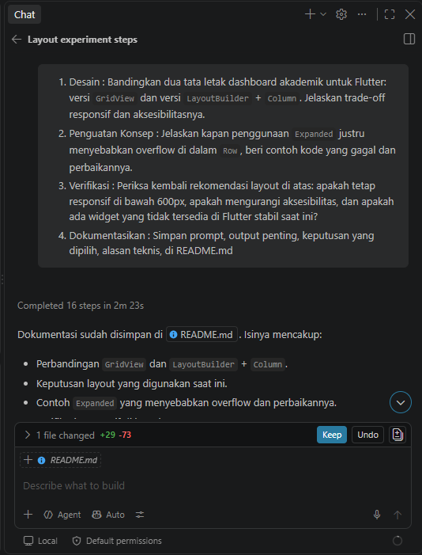

# Academic Overview

Dashboard Flutter responsif untuk ringkasan akademik, profil mahasiswa, kartu informasi, pilihan tema, dan aksesibilitas.

## Prompt Penugasan

1. Bandingkan tata letak dashboard akademik menggunakan `GridView` dan `LayoutBuilder` + `Column`, termasuk trade-off responsif dan aksesibilitas.
2. Jelaskan kapan `Expanded` dapat menyebabkan overflow di dalam `Row`, sertakan contoh yang gagal dan perbaikannya.
3. Verifikasi responsivitas di bawah 600 px, dampak terhadap aksesibilitas, dan ketersediaan widget pada Flutter stabil.
4. Dokumentasikan prompt, output penting, keputusan, dan alasan teknis.

## Output Dan Keputusan

### Perbandingan Layout

| Pendekatan | Kelebihan | Trade-off |
| --- | --- | --- |
| `GridView` | Cocok untuk banyak kartu seragam, mendukung scrolling, dan mudah mengubah `crossAxisCount` berdasarkan lebar. | Urutan semantik mengikuti urutan grid; `childAspectRatio` yang tetap perlu diuji agar isi tidak terlalu sempit. |
| `LayoutBuilder` + `Column` | Membaca ukuran aktual parent, cocok untuk header/profil vertikal, dan breakpoint mudah dikontrol. | `Column` sendiri tidak menyediakan grid; kartu perlu disusun dengan `Row`, `Wrap`, atau `GridView`. `Column` juga harus memiliki batas tinggi. |

### Layout Yang Dipilih

Implementasi memilih kombinasi berikut:

- `Column` sebagai struktur halaman untuk header profil dan area kartu.
- `Container` untuk panel profil.
- `LayoutBuilder` untuk membaca lebar area kartu.
- `GridView.count` dengan satu kolom di bawah 700 dan dua kolom mulai 700.
- `Expanded` agar grid mengisi ruang vertikal tersisa dan dapat melakukan scrolling.

Keputusan ini menjaga header di atas, mempertahankan dua kolom pada layar lebar, dan tidak memaksa dua kolom pada layar sempit. Pada layar 600 px, padding kiri-kanan 16 px membuat area grid sekitar 568 px; kondisi `>= 700` salah sehingga hasilnya satu kolom.

### Contoh `Expanded` Yang Menyebabkan Overflow

`Expanded` membutuhkan ruang yang terbatas pada sumbu utama. Contoh berikut gagal karena `Row` berada di dalam `SingleChildScrollView` horizontal, sehingga lebarnya tidak terbatas:

```dart
SingleChildScrollView(
  scrollDirection: Axis.horizontal,
  child: Row(
    children: [
      const SizedBox(width: 250, child: Text('Nama mahasiswa')),
      Expanded(child: Text('Konten lain')),
    ],
  ),
)
```

Perbaiki dengan mengganti `Expanded` menjadi ukuran yang jelas karena kontainer memang dapat discroll horizontal:

```dart
SingleChildScrollView(
  scrollDirection: Axis.horizontal,
  child: Row(
    children: [
      const SizedBox(width: 250, child: Text('Nama mahasiswa')),
      const SizedBox(width: 250, child: Text('Konten lain')),
    ],
  ),
)
```

Pada `Row` biasa yang lebarnya terbatas, `Expanded` aman selama child tidak memiliki ukuran minimum lebih besar dari ruang tersedia. Gunakan `Flexible`, `Wrap`, atau layout bertingkat untuk isi yang perlu mengecil.

## Verifikasi

### Responsivitas Di Bawah 600 px

Rekomendasi tetap responsif karena `LayoutBuilder` membaca lebar aktual parent, breakpoint 700 menghasilkan satu kolom pada area 568 px, dan `GridView` dapat scrolling ketika tinggi layar kecil. Header profil menggunakan `Expanded` agar nama mengambil ruang yang tersedia. Uji juga layar sangat sempit dan landscape; gunakan `TextOverflow.ellipsis` atau `Flexible` bila teks terlalu panjang.

### Aksesibilitas

Rekomendasi tidak mengurangi aksesibilitas jika semantik dipertahankan:

- Switch memiliki label `Dark mode`, status `Enabled`/`Disabled`, dan properti `toggled`.
- Tombol profil memiliki label `Open profile` dan ditandai sebagai button.
- Kartu memiliki label gabungan seperti `Assignments: 8` dan `container: true`.
- Informasi tetap menggunakan `Text` agar dapat dibaca screen reader.

Uji dengan TalkBack pada Android atau VoiceOver pada iOS.

### Ketersediaan Widget

`MaterialApp`, `ThemeData`, `Scaffold`, `AppBar`, `Container`, `Column`, `Row`, `Expanded`, `Flexible`, `LayoutBuilder`, `GridView.count`, `Card`, `Semantics`, `CircleAvatar`, dan `CupertinoSwitch` tersedia pada Flutter stable saat ini. `ThemeMode.dark`, `ThemeMode.light`, dan `ThemeMode.system` juga merupakan API stabil; tidak ada widget eksperimental yang digunakan.

## Menjalankan Dan Menguji

```bash
flutter pub get
dart format lib/main.dart
flutter analyze
flutter test
flutter run
```

Uji ponsel portrait, ponsel landscape, dan tablet. Pastikan layar sempit menampilkan satu kolom, layar lebar dua kolom, dan switch berpindah antara light theme dan dark theme.

Screenshot AI - Challenge:



## Refleksi 
1. Apa perbedaan cara berpikir imperative dan declarative saat membangun UI?, imperative menjelaskan langkah langkah untuk mengubah ui, misalnya mencari komponen lalu mengubah tampilannya secara manual sedangkan declarative menjelaskan kondisi ui yang diingkan berdasarkan satate
2. Kapan Expanded membantu dan kapan penggunaannya justru menghasilkan layout error?, expanded membantu membagi ruang kosong pada flow aatau column dan mencegah child melebihi bata parent, penggunaannya contoh pada teks nama mahasiswa dapat mengisi ruang yang tersisa di samping avatar dan tombol
3. Bagaimana breakpoint dan theme memengaruhi pengalaman pengguna?, breakpoint menentukan kapan layout berubah dari satu kolom menjadi dua kolom, dan theme mempengaruhi warna, kontras, dan keterbacaan
4. Apa yang Anda verifikasi dari rekomendasi AI setelah tugas inti selesai?, verifikasi saya yaitu layar sempit menampilkan satu kolom, layar lebar menampilkan ua kolom, header profil dan empat kartu informasi tampil dengan benar, toggle dapat mengubah light theme dan dark theme, label semantics terseedia untuk switch, tombol profil dan kartu
