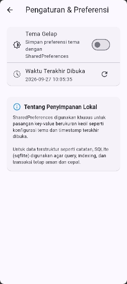

## 📸 Tampilan Aplikasi (Screenshots)

### 1. Tema & Tampilan Antarmuka
| Mode Terang (Light Mode) | Mode Gelap (Dark Mode) |
| :---: | :---: |
|  |  |

### 2. Alur Kerja Offline-First & Sinkronisasi
| Simulasi Mode Offline | Tambah Catatan Baru | Catatan Belum Tersinkron (`dirty = 1`) |
| :---: | :---: | :---: |
|  |  |  |

| Sinkronisasi Sukses (`dirty = 0`) | Detail & Edit Catatan (`/note/:id`) | Halaman Pengaturan & Preferensi |
| :---: | :---: | :---: |
|  |  |  |

### 3. Bukti Verifikasi Testing & Linter
| Hasil `flutter analyze` & `flutter test` |
| :---: |
|  |

---

## 🚀 Fitur Utama

1. **Penyimpanan Preferensi (`SharedPreferences`)**: Toggle tema gelap/terang dan pencatatan riwayat waktu buka aplikasi (`last_opened_at`).
2. **CRUD Catatan Lokal (`sqflite`)**: Tambah, baca, edit, dan hapus catatan secara instan tanpa koneksi internet (`ORDER BY updated_at DESC`).
3. **Mekanisme Offline-First & Dirty Flag**: Penandaan otomatis `dirty = true` pada catatan lokal baru/editan, lengkap dengan badge visual dan counter badge pada AppBar.
4. **Sinkronisasi Server (`syncNotes`)**: Pengiriman data catatan kotor ke server simulasi lalu pembersihan flag (`dirty = 0`).
5. **Simulasi Offline Deterministik (`forceOffline`)**: Toggle konektivitas di AppBar untuk simulasi tanpa mematikan koneksi fisik perangkat.
6. **Strategi Cache-First API**: Tab pembacaan data instan dari SQLite `cached_posts` dengan background refresh Dio.
7. **Navigasi GoRouter & Ekstraksi Widget**: Routing `/note/:id` yang membaca langsung dari repository lokal dan pemisahan komponen `NoteTile`.

## 🔄 Aturan Resolusi Konflik (Conflict Resolution)

Menerapkan aturan **Last-Write-Wins (LWW)** berdasarkan timestamp ISO 8601 `updated_at`:
- Catatan dengan nilai `updated_at` paling akhir akan menjadi versi pemenang saat sinkronisasi ganda terjadi.
- Setiap perubahan lokal otomatis memperbarui `updated_at = DateTime.now()` dan mengaktifkan `dirty = 1`.

---

## ❓ Jawaban Pertanyaan Refleksi Modul

### 1. Mengapa daftar catatan tidak boleh disimpan di SharedPreferences? Apa yang rusak jika aturan ini dilanggar?
- **Pemuatan In-Memory Penuh:** SharedPreferences membaca seluruh file XML/plist ke RAM saat startup. Menyimpan list catatan (JSON string besar) akan memboroskan RAM secara permanen.
- **Ketiadaan Fitur Kueri & Indeks:** Tidak mendukung kueri terstruktur seperti `WHERE dirty = 1`, `ORDER BY updated_at DESC`, pencarian teks, ataupun pagination. Seluruh data harus di-*parse* manual di UI thread yang memicu *jank*.
- **Risiko Kerusakan Data Total:** Setiap mutasi menimpa seluruh file. Jika terjadi crash saat penulisan, seluruh file preferensi korup dan seluruh catatan hilang sekaligus.

### 2. Kapan cache-first cukup, dan kapan Anda membutuhkan strategi lain (misal network-first)?
- **Cache-First Cukup:** Untuk data yang jarang berubah dan toleran terhadap keusangan (*read-heavy*), seperti profil, katalog statis, daftar artikel berita, atau feed postingan agar aplikasi instan dibuka tanpa layar putih (*blank screen*).
- **Network-First Wajib:** Untuk data dinamis bernilai kritis (*time-sensitive*) dengan dampak finansial/keamanan, seperti harga saham/kripto real-time, ketersediaan tiket/stok barang (*pencegahan overbooking*), serta mutasi saldo dan verifikasi token autentikasi.

### 3. Bagaimana dirty flag berubah menjadi antrean sync tanpa memblokir UI? Kapan tabel outbox diperlukan?
- **Alur Tanpa Memblokir UI:** Flag `dirty = 1` disimpan di SQLite. Antarmuka membacanya via Riverpod secara asinkron. Fungsi `syncNotes()` memproses catatan kotor di background via `Future`/Isolate, dan setelah server merespons sukses (HTTP 2xx), barulah flag diubah menjadi `dirty = 0`. UI terupdate reaktif tanpa pernah macet.
- **Kebutuhan Tabel Outbox:** Diperlukan saat sistem harus melacak operasi **penghapusan data (*hard delete*)** agar server tahu item yang dihapus, serta untuk menjaga **urutan eksekusi mutasi beruntun (*FIFO ordering/replay log*)** pada relasi data yang kompleks.

### 4. Bagian mana dari rekomendasi AI yang Anda tolak, dan mengapa?
1. **Penolakan Menyimpan List di SharedPreferences:** AI sempat menyarankan serialize JSON ke SharedPreferences demi kode ringkas. Ditolak karena melanggar prinsip skalabilitas, beban RAM tinggi, dan ketiadaan fitur kueri.
2. **Penolakan Boilerplate Drift Berlebih:** Rekomendasi memakai Drift ditolak untuk skala tugas codelab karena membutuhkan generator `build_runner` yang berat dan memperlambat build. Kombinasi `sqflite` + *Repository Pattern* + *Riverpod* terbukti jauh lebih transparan, mudah diuji via *Fake Repository*, dan efisien.
3. **Penolakan Sinkronisasi Penuh (*Full Overwrite*):** Usulan mengirim seluruh database ditolak dan diganti dengan **Differential Sync (hanya catatan dengan `dirty = 1`)** untuk menghemat kuota dan bandwidth.

---

## 🤖 Ringkasan AI Challenge

Detail lengkap perbandingan 4 storage (SharedPreferences, Hive, sqflite, Drift) dan skema indeks 1000+ data tersedia di [`docs/ai_challenge.md`](file:///c:/Users/HAMI/Downloads/College/Semester%205/Pemrograman%20Mobile/244107020232-mobile-course/05-week-5-local-storage-offline-first/week5_offline_notes/docs/ai_challenge.md).

| Kebutuhan | Storage Terpilih | Justifikasi |
| :--- | :--- | :--- |
| **Preferensi Tema & Riwayat Buka** | `SharedPreferences` | Data primitif sederhana (bool & ISO string), akses instan tanpa overhead database engine. |
| **Catatan & Cache API** | `sqflite` (SQLite) | Mendukung kueri relasional, indexing `updated_at` & `dirty`, transaksi ACID, dan isolasi fake test. |

---

## ⚠️ Error Umum & Solusinya

1. **`MissingPluginException`**: Terjadi bila plugin baru ditambahkan tanpa build ulang penuh. Solusi: hentikan aplikasi dan jalankan ulang `flutter run`.
2. **`DatabaseException: table notes already exists`**: Terjadi karena perubahan skema tanpa migrasi. Solusi: naikkan nilai `version` dan terapkan `onUpgrade`, atau uninstall aplikasi saat dev.
3. **Badge Dirty Tidak Pernah Nol**: Terjadi bila `markAllSynced()` tidak dipanggil setelah transmisi berhasil.
4. **UI Tidak Refresh**: Terjadi jika lupa memanggil `ref.invalidate(notesProvider)` setelah mutasi data.
5. **Test Menyentuh Database Sungguhan**: Gunakan `FakeNoteRepository` yang meng-override `openDb: () => throw UnimplementedError()` dan di-inject via `overrideWithValue`.
6. **`Bad state / Worker error` di Web (`flutter run -d chrome/edge`)**: SQLite di browser membutuhkan WebAssembly & Web Worker. Solusi: jalankan `dart run sqflite_common_ffi_web:setup` untuk mengunduh `sqflite_sw.js` & `sqlite3.wasm` ke folder `web/`, serta inisialisasi `databaseFactoryFfiWeb` saat `kIsWeb`.

---

## 👤 Pengembang
- **NIM:** 244107020232
- **Mata Kuliah:** Pemrograman Mobile
- **Pertemuan:** Minggu 5 - Local Storage & Offline First
